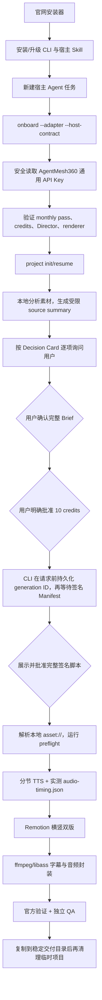

# 商业工作流经验与防回归清单（CLI / 本地客户端）

本文记录一次真实宿主 Agent 从安装商业版 LectureCast、绑定 AgentMesh360 通用
API Key、确认 Brief 与付费 generation，到本机完成横竖双版视频和两张封面的完整
路径。目标是把偶然成功变成可重复的产品能力。

本文只讨论公开 CLI、安装器、宿主 Skill、项目状态与本地渲染。Director、credit
ledger、Manifest 签名和生产恢复的 Server 责任见
[lecturecast-server 的对应文档](https://github.com/jiyangnan/lecturecast-server/blob/main/docs/COMMERCIAL-WORKFLOW-LESSONS.zh.md)。

规范优先级：本仓 [LECTURECAST-SYSTEM-BOUNDARY.md](LECTURECAST-SYSTEM-BOUNDARY.md)
只权威定义公开 CLI/本地客户端归属；Server/服务侧归属以 Server 仓库同名文档为准。
跨仓行为由版本化 API、Manifest schema 与契约测试共同约束，任一仓的边界文档都
不能替另一仓改写实现责任。[LOCAL-WORKFLOW.md](LOCAL-WORKFLOW.md) 定义可执行顺序，
[NARRATION-TIMING-CONTRACT.md](NARRATION-TIMING-CONTRACT.md) 定义精确时长容差；
本文负责事故经验和防回归清单。

## 一句话结论

宿主 Agent 不是“知道几个 lecturecast 命令”就能正确制作视频。可靠路径必须由
安装器拥有的 Skill 启动，以 CLI 返回的 `workflow.next_action` 为唯一控制流，以
本地项目为持久状态源，在用户批准完整签名脚本后，先生成并测量真实 TTS，再用同一
时间线驱动画面、字幕和 composition duration。

`--host-contract 1.0.0` 是宿主 Skill 证明合同；ProductionManifest
`schema_version=1.0` 是创作方案合同，两者不能混为一谈。完整脚本是签名 Manifest
内的 `script[]`，不是另一个独立签名对象；本地 approval receipt 同时绑定 Manifest
digest 和从 `script[]` 计算的 script digest。

## 标准客户路径



## CLI / 本地客户端必须拥有的职责

| 责任     | CLI 必须保证                                                   |
| -------- | -------------------------------------------------------------- |
| 安装     | CLI 与 Skill 同批升级；普通旧目录先备份再替换；重复安装幂等    |
| 宿主证明 | 每个新/恢复任务都证明 adapter、host contract 和 Skill digest   |
| 凭证     | 从文档化位置安全读取；不进入参数、项目、日志、Prompt 或 stdout |
| 商业门禁 | project、Director、Manifest 和官方渲染写入口全部 fail closed   |
| 控制流   | 成功命令之后只执行返回的 `workflow.next_action`                |
| 状态     | `.lecturecast/` 是唯一恢复源，不从聊天记录重建 ID              |
| Manifest | 本地验证生产签名；保存只读；脚本批准与 digest 绑定             |
| 素材     | 把逻辑 `asset://` 映射到项目内真实本地文件，原始媒体不上传     |
| 时间线   | 本地生成 TTS、实测时长、派生 digest 绑定的执行计划             |
| 渲染     | 同一执行计划驱动横竖场景、字幕、视频时长和封面                 |
| 交付     | 验证尺寸、完整解码、音频覆盖、字幕字形和输出文件               |

## 踩坑与长期规则

### 1. 安装成功不等于宿主任务已加载新 Skill

正在运行的 Codex、Claude Code 或 OpenClaw 任务可能仍持有安装前的 Skill 内容。
仅检查 CLI 版本会产生“CLI 是新的、Agent 行为却是旧的”分裂状态。

正确规则：

1. 安装器升级 CLI 后同步安装当前 host adapter。
2. 普通目录形式的旧 Skill 做时间戳备份后替换。
3. 指向其他安装源的 symlink/junction 视为冲突，不静默覆盖。
4. 安装或升级后新建宿主任务。
5. `onboard --adapter ... --host-contract ...` 同时验证安装器所有权和 Skill digest。

所有项目写入口都必须验证 `.lecturecast/host-workflow.json`，不能只靠 Skill 文案提醒。

### 2. `workflow.next_action` 是协议，不是建议

宿主 Agent 容易根据记忆拼出“看起来类似”的命令，或直接调用模板 helper。这样会
丢失 adapter、host contract、generation ID、项目路径或审批边界。

正确规则：

- 每个成功响应后只执行返回的 `workflow.next_action`；
- 只替换响应明确允许的稳定 ID、用户选择或本地项目值；
- recovery/read-only 响应没有 workflow 时，运行文档指定的 `agent status`；
- 任何 `requires_user_approval=true` 都必须暂停；
- 不从聊天记录、截图或旧项目复制 session/generation ID。

唯一协议化例外是一次付费 `director generate` 的响应可能在网络层丢失：先执行
`director status`；只有它以 `error.code=session_not_found` 明确表示原 ID 未落库时，
才可重跑原 `director generate` 命令。CLI 会复用请求前已持久化的 generation ID；
这不是第二条控制流，也不授权创建新 ID。

`renderer.next_actions` 是 onboarding 被本地依赖阻塞时返回的修复动作，不推进
项目状态，也不替代 `workflow.next_action`。执行这些修复后应重新运行 `onboard`，
只有 `workflow.ready=true` 才回到唯一项目控制流。

### 3. Shell next action 必须继承同一商业运行环境

一次真实运行中，直接执行返回的 `bash build_manifest_video.sh` 曾继承真实 HOME 中
的旧 Skill；切换隔离 HOME 后又因为没有同步凭证而失败。根因不是 build script，
而是宿主从 CLI 进程切换到 shell 时丢失了已验证的运行上下文。

产品规则：

- 官方 render next action 必须在安装器拥有的 HOME、CLI、Python 与 Skill 上下文中执行；
- 凭证只以进程环境或安全 credential provider 注入，绝不写进脚本；
- adapter/Skill receipt 必须在 helper 内再次验证，失败时不生成媒体；
- 测试必须覆盖“真实 HOME 存在同名旧 Skill、隔离 HOME 使用当前 Skill”的情况。

### 4. 凭证读取要有稳定顺序，且不泄露

通用 AgentMesh360 API Key 应通过 `lecturecast auth login` 写入系统安全存储。自动化
宿主读取时必须遵循客户端文档化的 credential provider 顺序；不能全盘搜索文件、
输出完整 key，或把 key 放进命令参数。

防回归要求：

- 无 key、无效、过期、scope 不符、Core 请求失败全部 fail closed；
- monthly pass、trial、expired 与未知来源矩阵有契约测试；
- 日志最多保留不可逆指纹或末四位；
- 本地项目、Manifest、handoff、QA artifact 中均不得出现 key。

### 5. `asset://` 是逻辑合同，必须给出可执行诊断

Director 不知道用户文件路径，只能声明逻辑素材，例如
`asset://source/product_intro_screen`。CLI 负责把它解析到项目的
`.lecturecast/assets/`，并在渲染前验证媒体类型、普通文件、存在性和组件契约。

一次真实运行中，预检只提示 `local_assets` 失败，宿主需要继续查代码才能知道精确
目标路径。长期改进方向是错误响应直接返回：

- 缺失的 logical URI；
- 精确项目相对路径；
- 期望媒体类型；
- 是否允许从已确认的本地 source 抽取；
- 修复后应重新执行的只读 preflight。

宿主可以从用户已提供的本地素材中抽取满足事实边界的帧，但不能虚构截图、修改签名
Manifest 或把素材上传到 Director。

当前恢复时必须从 `local_assets` 检查结果取得 logical URI，解析到
`<project>/.lecturecast/assets/<logical-path>`，补齐普通本地文件后重新执行响应返回
的 preflight。精确要求不靠猜扩展名：在签名 Manifest 对应 `scenes[].assets[]` 中读取
同一 URI 的 `media_type` 与 `required`，并由 preflight 对照该 scene 的 component
catalog `asset_requirements.allowed_media_types`。等价的显式检查为：

```bash
lecturecast manifest preflight \
  <project>/.lecturecast/production-manifest.json \
  --project-root <project> --json
```

### 6. 本地渲染前必须完成全部 preflight

本地预检至少覆盖：

- Manifest schema 与生产签名；
- ClientCapabilities digest；
- component catalog digest、组件 allowlist 与 Props 合同；
- `asset://` 本地解析；
- 输出比例与格式；
- voice engine；
- 静态 narration timing；
- Node、Remotion、ffmpeg；
- libass 与 CJK 字体。

任一检查失败都应在 TTS 或逐帧渲染前停止。修复本地依赖后重新预检不需要新
generation，也不能重新扣费。

### 7. Remotion 浏览器必须提前 ensure 并做冷启动探测

首次渲染可能需要下载 Headless Chrome；在 Apple Silicon 上，如果 Node/Chrome 为
x86_64，还会经过 Rosetta 冷启动。固定 25 秒连接超时可能在浏览器实际可用前失败。

正确顺序：

1. `npm install --no-fund --no-audit`；
2. `npx remotion browser ensure`；
3. 在 episode 的 `remotion/` 内运行可复制的冷启动 smoke。

   macOS：

   ```bash
   mkdir -p out/fixtures
   npx remotion still \
     DirectorCoverLandscape out/fixtures/browser-smoke.png
   ```

   Windows PowerShell：

   ```powershell
   New-Item -ItemType Directory -Force out/fixtures | Out-Null
   npx.cmd remotion still `
     DirectorCoverLandscape out/fixtures/browser-smoke.png
   ```

   命令必须退出 0，且 PNG 可读取、尺寸为 1920×1080；

4. 明确区分下载超时、进程启动超时与 composition 错误；
5. 本地浏览器失败后复用同一 Manifest 和已经生成的 TTS，不创建新 generation。

安装器/doctor 应报告 Node 与浏览器架构，避免把 Rosetta 性能问题误判成 Director
或网络问题。

### 8. 真实 TTS 必须先于最终场景时间线

本次路径中，签名计划约 333 秒，本地 Edge TTS 实测约 371 秒。正确做法不是改写
Manifest，也不是让 38 秒音频后面填静音，而是：

1. 按签名脚本逐节生成音频；
2. probe 每节真实时长；
3. 重新编码并拼接旁白；
4. 写入 digest 绑定的 `audio-timing.json`；
5. 用实测帧数共同驱动场景、字幕和 composition duration；
6. 每节及总时长的实测/计划比例必须在 75–125%；
7. 最终视频与实测旁白相差不得超过一秒；
8. 超出合同允许比例时在 Remotion 前停止。

因此一份 Manifest 可以保持创作不可变，同时适应不同 TTS 引擎的合理语速差异。
标准产品的计划时长是 240–390 秒；75–125% 的技术安全包络意味着总旁白极值可达
180–487.5 秒（3:00–8:07.5）。这个包络用于拒绝异常 TTS，不等于承诺所有通过者都
严格“约五分钟”；对外报告必须同时写明签名计划时长与实测成片时长。
详细合同见 [NARRATION-TIMING-CONTRACT.md](NARRATION-TIMING-CONTRACT.md)。

### 9. “本地制作”不等于“全部离线”

LectureCast Server 不接收原始媒体、TTS 文件或成片；但默认 Edge TTS 仍是由本地
客户端发起的网络语音服务，旁白文本会发送到 Microsoft Edge 语音端点做合成。
MiniMax BYOK 同理会把脚本文本发送到用户自己的 MiniMax 账户。

产品文案和隐私检查必须区分：

- **留在本机：** 原始媒体、本地路径、生成后的音频文件、字幕、画面和最终输出；
- **发送给 Director：** 受限 source summary、稳定选择、Brief 和能力元数据；
- **发送给 TTS provider：** 生成旁白所需的脚本文本，不包含原始媒体。

不能把“音频在本机生成和保存”写成“整个 TTS 过程离线”。

### 10. 字幕能力不能只检查“有 ffmpeg”

普通 ffmpeg 可能不带 libass；CJK 字体名称存在但无法解析时，烧录结果会出现方框。

macOS 应只在当前 shell 把 `ffmpeg-full` 放到 PATH 前面，不修改全局 Homebrew 链接。
ASS 生成后应检查默认/override Fontname，并从 libass `fontselect` 日志确认真实字体解析。

测试至少覆盖：

- 横竖 ASS 均使用平台默认 CJK 字体；
- `LECTURECAST_SUBTITLE_FONT` override 生效；
- 横竖各烧录一秒真实中文；
- 无 missing glyph，抽帧不是方框。

### 11. “命令成功”不等于视频可交付

官方 build 的第八步必须验证四项输出，但宿主 Agent 仍应做与故障直接相关的独立 QA。
本次 38 秒后无声问题的验收口径是：

- `ffprobe`：视频流、音频流都覆盖完整时长；
- `silencedetect`：从已知故障点到片尾没有异常长静音；
- `astats`：片尾窗口仍有正常 RMS/peak；
- 完整 decode：视频和音频均无解码错误；
- 关键帧：开头后、中央、片尾的字幕字形和版面正常；
- 横版是真正 1920×1080 composition，竖版是真正 1080×1920。

只有通过这些检查，才把视频和封面复制到稳定交付目录。

商业标准路径的四项交付物必须由 Manifest `outputs[]` 明确列出：1920×1080 的 16:9 MP4、
1080×1920 的 9:16 MP4，以及同尺寸的两张 PNG 封面。文件名以
`outputs[].filename` 为权威，不由宿主猜测。稳定交付目录由用户或宿主选择，不是
产品固定路径；未来若扩展输出 profile，必须升级版本化合同，宿主不得自行增减。
QA 证据默认不作为面向用户的交付物，除非用户要求或问题恢复需要。

### 12. 先交付，再清理；不要把临时目录当项目状态

`.lecturecast/` 包含 Director ID、签名 Manifest、审批 receipt、本地素材映射和执行
时间线，是恢复源。渲染期间不能只保留输出文件、删除项目后靠聊天记录恢复。

完成顺序：

1. 官方 build 和独立 QA 通过；
2. 复制两条视频、两张封面及必要 QA 证据到稳定目录；
3. 校验复制后的 hash 和完整解码；
4. 核对 credit 没有额外变化；
5. 最后删除任务拥有的临时 HOME、venv、npm cache、clone 和项目。

不得清理用户真实 Skill、凭证、主工作树、其他项目 venv 或不确定目录。

## 失败恢复表

| 现象                               | 归属                       | 正确恢复                                                                                                                                                                      | 禁止动作                       |
| ---------------------------------- | -------------------------- | ----------------------------------------------------------------------------------------------------------------------------------------------------------------------------- | ------------------------------ |
| `host_adapter_not_installer_owned` | 安装器/宿主 Skill          | 更新并新建宿主任务，重新 onboard                                                                                                                                              | 复制 contract version 伪造通过 |
| `missing_credential`               | CLI credential context     | 运行 auth login 或安全读取系统 credential                                                                                                                                     | 把 key 写进脚本/参数           |
| monthly pass / Core 校验失败       | 商业门禁                   | 按 `user_prompt` 处理并暂停                                                                                                                                                   | 提供免账户本地路线             |
| Director 请求超时                  | 网络/Server 恢复           | 先运行 `lecturecast director status <project> --json`；仅当它返回 `error.code=session_not_found` 时重跑 `director generate <project> --json`，CLI 会复用请求前已持久化的原 ID | 创建第二个 generation ID       |
| `local_assets`                     | 本地素材解析               | 按 logical URI 补齐项目资产，再运行 `manifest preflight <manifest> --project-root <project> --json`                                                                           | 改 Manifest 或上传原始媒体     |
| missing libass/font                | 本地 ffmpeg/字体           | 当前 shell 使用合格 ffmpeg/font                                                                                                                                               | 改全局 Homebrew 环境           |
| Chrome connection timeout          | 本地 Remotion runtime      | ensure/探测浏览器，复用本地音频再渲染                                                                                                                                         | 重新付费生成                   |
| timing ratio 超界                  | 脚本/TTS 合同              | 停止并请求正确 Manifest                                                                                                                                                       | 填静音或强行拉伸               |
| final audio coverage mismatch      | 本地 execution-plan wiring | 拒绝交付并检查 props/字幕/封装                                                                                                                                                | 只看 MP4 文件存在              |

## CLI 发布前防回归清单

- [ ] fresh install 和重复安装都通过，版本与 release commit 一致。
- [ ] 普通目录旧 Skill 会备份并升级，外部 symlink/junction 会明确阻塞。
- [ ] 新宿主任务能证明 Skill digest；旧任务写入口 fail closed。
- [ ] 无 key、trial、expired、unknown、Core failure 全部 fail closed。
- [ ] active monthly pass 按 Core 权威字段放行，不读取 legacy tier 判定。
- [ ] project、Director、Manifest 与 render 写入口都有 CLI 级硬门禁。
- [ ] 只读 status/inspect/verify 在安全范围内可用。
- [ ] 超时恢复保留同一 session/generation ID，credit 不重复扣。
- [ ] Manifest 签名、component digest、asset URI 和审批 receipt 均被预检。
- [ ] Remotion browser ensure 与冷启动 smoke 在长片前完成。
- [ ] 真实 TTS 时长共同驱动横竖画面和字幕。
- [ ] macOS/Windows 的 libass 与 CJK 字体 fixture 通过。
- [ ] 横竖 MP4、双封面、音轨覆盖、关键帧和完整解码验收通过。
- [ ] 原始媒体、API Key 与用户路径没有进入网络请求、日志或 outcome evidence。

## 相关文档

- [本地工作流](LOCAL-WORKFLOW.md)
- [旁白时长合同](NARRATION-TIMING-CONTRACT.md)
- [支持平台](SUPPORTED-PLATFORMS.md)
- [签名 keyring](SIGNING-KEYRING.md)
- [本地结果证据](LOCAL-OUTCOME-EVIDENCE.md)
- [系统边界](LECTURECAST-SYSTEM-BOUNDARY.md)
- [Server 经验与防回归清单](https://github.com/jiyangnan/lecturecast-server/blob/main/docs/COMMERCIAL-WORKFLOW-LESSONS.zh.md)
